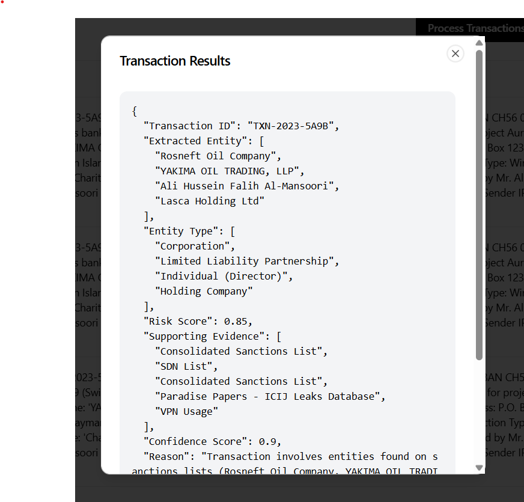

# 🚀 Scam-ur-ai

## 📌 Table of Contents
- [Introduction](#introduction)
- [Demo](#demo)
- [Inspiration](#inspiration)
- [What It Does](#what-it-does)
- [How We Built It](#how-we-built-it)
- [Challenges We Faced](#challenges-we-faced)
- [How to Run](#how-to-run)
- [Tech Stack](#tech-stack)
- [Team](#team)

---

## 🎯 Introduction
This project helps analysing risk from transaction in real-time and gives a comprehensive Risk Report💥.

## 🎥 Demo 
📹 [Video Demo](./artifacts/demo/demo-video.mp4)
🖼️ Screenshots:


*Landing Page*

*Unstructured Data Loaded*

*Structured Data Loaded*

*Returned JSON*

*Download Options*

[Documentation](./artifacts/demo/Solution.pdf "Presentation PDF")


## 💡 Inspiration
Real-time risk analysis is much required for analysing transactions involving new entities for which banks may not have any history. Latest news articles, sanction lists or information about the entities involved along with reviewing key transaction details can help in analysing risk in realtime and blocking such transactions.

## ⚙️ What It Does
This solution extracts entities from the transaction, searches from them in the open-source databases and news and fetches data from them to finally generates a risk analysis report.

## 🛠️ How We Built It
We have used ReactJS, Tailwind CSS and Radix UI on frontend and FastAPI on the backend. For our external data sources where we look for entities we are using OFAC API, Wikidata, NewsAPI, ICIJ Leaks API and locally downloaded files containing list of sanctioned entities and PEPs. For Entity Recognition, sentiment analysis from News Articles and overall risk scoring and risk analysis we are using Gemini API Free Tier with the Gemini 2.0 Flash model.

The architecture Diagram is as follows:


## 🚧 Challenges We Faced
- Handling Entities not found in any data sources like Wikidata, sanctions, news etc.
- Choosing metrics by which to quantify risk and confidence in the form of a numerical score
- Handling rate limitations and quotas on certain APIs like OFAC API and News API which could result in less data available for Risk Analysis.

## 🏃 How to Run
1. Clone the repository  
   ```
   git clone https://github.com/ewfx/aidel-scam-ur-ai.git
   ```
2. Install npm dependencies  
   ```
   cd code/src/transaction-uploader-hub-main
   npm install
   ```
3. Install python dependencies  
   ```
   cd code/src/backend
   pip install -r requirements.txt
   ```
4. Run the frontend  
   ```
   cd code/src/transaction-uploader-hub-main
   npm run dev
   ```
5. Run the api
   ```
   cd code/src/backend
   uvicorn app:app --reload
   ```
## 🏗️ Tech Stack
- 🔹 Frontend: ReactJS, TailwindCSS, RadixUI
- 🔹 Backend:  FastAPI
- 🔹 Database: None
- 🔹 Other: Gemini API, OFAC API, News api, WikiData, Sanctions Lists, ICIJ Leaks API

## 👥 Team
- **Mayank Panda** - [GitHub](https://github.com/MayankPanda)
- **Harshit Bhalla** - [GitHub](https://github.com/aspirin01)
- **Keerthana S** - [GitHub](https://github.com/keerth02)
- **Himanshu Wadhwa** - [GitHub](https://github.com/ninjacode01)
